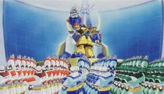
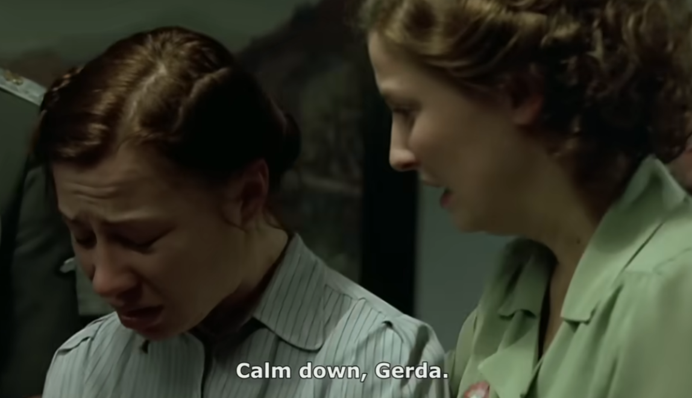

Dumb idea I had.

Was never really a fan of Repliforce. It seemed less like they got suckered in by Sigma and it was more like they had similar goals.

I played Mega Man X4 a lot in high scool and then I got into anime and eventually Japanese.

I burned some Rockman X4 which definitely acted to solidify my distrust in Repliforce.

So Mobile Suit Gundam Wing came out in 1995 and Mega Man X4 came out in 1997.

Both of these have some pretty sympathetic portrayls of nazi characters.

Lady Une is actually similar to Colonel and Iris in the fact that they both represent split personalities.

So the opening https://en.wikipedia.org/wiki/Mega_Man_X4.

"The score features the opening theme "Makenai Ai ga Kitto aru" (負けない愛がきっとある; lit. "Unbeatable Love I Surely Have") "

https://www.youtube.com/watch?v=oKwp2QKL5XI

it is really good but unfortunately has this part

https://en.wikipedia.org/wiki/Elon_Musk_salute_controversy

This was taken out of the English opening and all Japanese after this release don't include this opening either. There is a Gamecube collection that didn't have a Japanese release. The switch legacy collection replaced the Japanese opening with the English song opening aside from the opening title being in Japanese.

[Downfall (2004) - Clip 1: Steiner's Attack](https://www.youtube.com/watch?v=xBWmkwaTQ0k)

Gihren Zabi 

"You are Following The Footsteps of Adolf Hitler"

Gihren Zabi's father.

Anyways, when I think of Iris I think 

https://youtu.be/xBWmkwaTQ0k?si=kuUnPn87r5VQ5bpl&t=192

The Boys S02E08 What I Know 1080p BluRay R10Bit DDP5 1 HEVC-d3g

godot version

44:02  - 44:06

So, scale down the quality of this and overlay iris onto stormfront.

https://www.spriters-resource.com/playstation/mmx4/asset/85953/

https://www.youtube.com/watch?v=3IPIPLM8ELY

